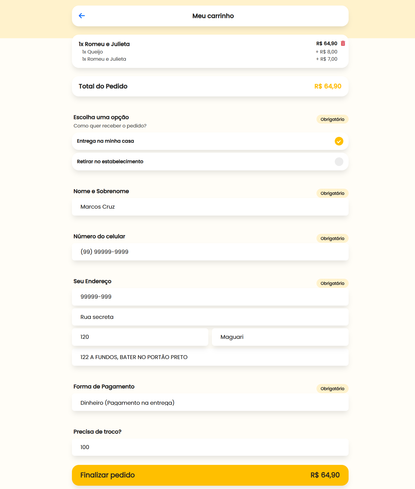

# 🍕 Delivery Pizzaria Maluca

Um sistema completo de delivery (Full-Stack) projetado com arquitetura monorepo, contendo um aplicativo de compras para o cliente final e um painel de administração robusto (ERP) para a gestão completa da pizzaria.

---

## 📸 Galeria do Projeto

### 📱 Visão do Cliente (Web App)

|                                Cardápio & Categorias                                 |                                       Detalhes do Produto                                        |                                  Carrinho Inteligente                                   |                                    Radar do Pedido                                    |
| :----------------------------------------------------------------------------------: | :----------------------------------------------------------------------------------------------: | :-------------------------------------------------------------------------------------: | :-----------------------------------------------------------------------------------: |
|  |  |  |  |

### 💻 Visão da Pizzaria (Painel Admin)

|                                   Kanban de Pedidos                                   |                                  Edição de Cardápio                                   |                                 Configuração de Taxas                                  |                                 Dashboard e Relatórios                                 |
| :-----------------------------------------------------------------------------------: | :-----------------------------------------------------------------------------------: | :------------------------------------------------------------------------------------: | :------------------------------------------------------------------------------------: |
|  |  |  |  |

---

## 🚀 Principais Funcionalidades

### 🛒 Experiência do Cliente

- **Cardápio Dinâmico:** Visualização de pizzas, bebidas e opções tradicionais/doces.
- **Customização de Pedidos:** Sistema avançado de opcionais (bordas, ingredientes extras) com cálculos matemáticos em tempo real.
- **Carrinho Persistente:** Uso de LocalStorage para "memória de elefante" (não perde o carrinho nem os dados de endereço ao fechar a página).
- **Checkout Descomplicado:** Máscaras automáticas de telefone e CEP, cálculo de troco e validação de áreas de entrega.
- **Acompanhamento (Radar):** Tela que atualiza em tempo real o status do pedido (Pendente ➔ Em Preparo ➔ Saiu para Entrega), integrado à API do WhatsApp.
- **Motor de Horários:** Bloqueio automático de compras fora do horário de funcionamento configurado pelo Admin.

### 🏢 Gestão (Admin)

- **Kanban de Pedidos:** Fluxo visual de trabalho em tempo real, desde o recebimento até a conclusão.
- **Gestão de Cardápio:** Criação e edição de categorias, produtos, imagens e grupos de opcionais (com limites de "mínimo" e "máximo").
- **Configurações Logísticas:** Controle de tempo de entrega, e definição de taxas dinâmicas (taxa fixa, por distância em KM, ou grátis).
- **Dashboard de Faturamento:** Gráficos interativos e relatórios detalhados de histórico de pedidos e ticket médio.

---

## 🛠️ Tecnologias Utilizadas

- **Frontend:** HTML5, CSS3, TypeScript (Vanilla DOM Manipulation), Bootstrap 5, FontAwesome.
- **Backend:** Node.js, Express, TypeScript.
- **Banco de Dados:** MySQL2 (Queries parametrizadas, Joins complexos e Transações Seguras).
- **Arquitetura:** Monorepo (dividido em `server`, `web` e `admin`).

---

## 🧠 Desafios Técnicos e Soluções

Durante o desenvolvimento, algumas decisões arquiteturais cruciais foram tomadas para garantir performance e escalabilidade:

1. **SPA Roteamento sem Frameworks Pesados:** \* **Desafio:** Criar uma navegação fluida (Single Page Application) no cliente sem depender de bibliotecas pesadas como React ou Angular.
    - **Solução:** Implementação de um Hash Router customizado em Vanilla TypeScript, lendo as mudanças na URL (`window.location.hash`) para injetar componentes de forma limpa e muito rápida.

2. **Transações Seguras de Banco de Dados (ACID):**
    - **Desafio:** Ao finalizar um pedido, o sistema precisa gravar na tabela `pedido`, na tabela `pedidoitem` (pizzas) e na `pedidoitemopcional` (bordas/adicionais). Se um der erro, o banco não pode ficar com dados pela metade.
    - **Solução:** Uso estrito de transações MySQL (`BEGIN`, `COMMIT`, `ROLLBACK`) no Service do backend. O banco só salva o pedido se 100% da operação der certo.

3. **Acompanhamento de Status "Em Tempo Real":**
    - **Desafio:** Manter o cliente atualizado sobre o preparo do pedido.
    - **Solução:** Criação de um sistema de _Polling_ no frontend aliado a um algoritmo lógico que verifica o `idpedidostatus` e altera dinamicamente os ícones e mensagens visuais do radar sem precisar dar refresh na página.

4. **Gerenciamento de Estado Local:**
    - **Desafio:** Manter o carrinho de compras do usuário ativo em toda a sessão e auto-preencher os dados de endereço do cliente recorrente.
    - **Solução:** Criação do módulo `cartManager` interceptando os dados em JSON e persistindo no `LocalStorage` do navegador, injetando reatividade nos botões e no menu inferior (`BottomMenu`).

---

## ⚙️ Como Executar o Projeto

**1. Clone o repositório e instale as dependências:**

```bash
git clone [https://github.com/MarcosCruzOn/Delivery-pizzaria-maluca.git](https://github.com/MarcosCruzOn/Delivery-pizzaria-maluca.git)
cd delivery_pizzaria_maluca
npm install
```
